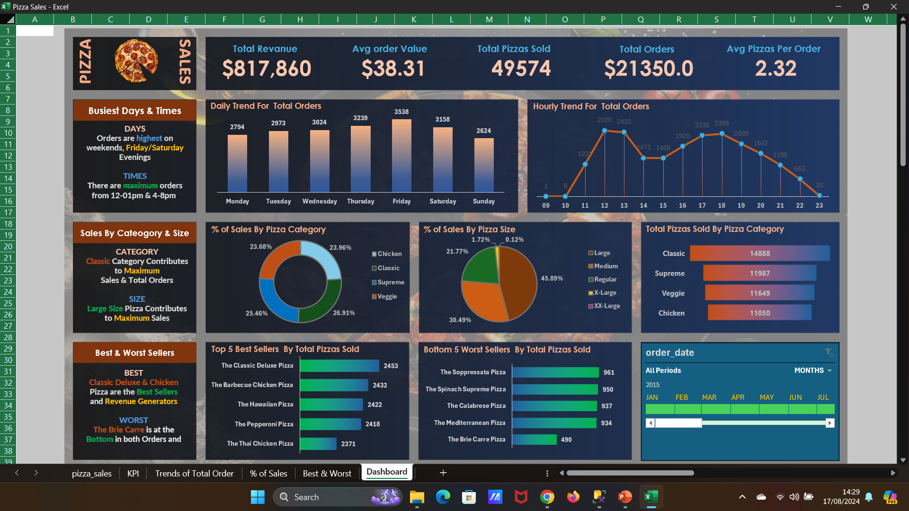
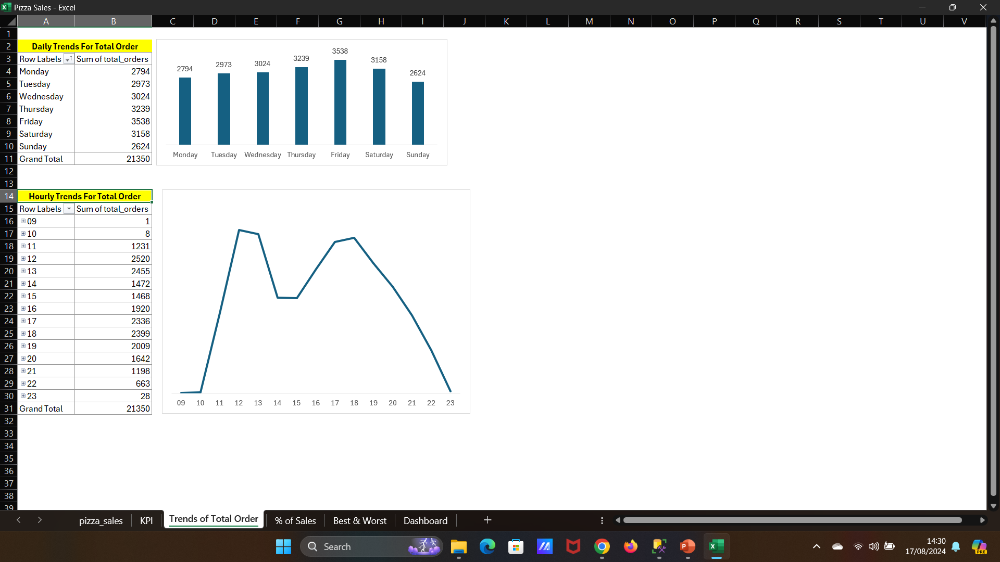

# 🍕 Pizza Sales Analysis Using SQL and Excel

## ⭐ Situation
What if the Domino's pizza chain was facing challenges in understanding the key performance indicators (KPIs) of its sales data. There will be a need for a comprehensive analysis to track sales trends, optimize inventory, and improve decision-making related to product offerings. The leadership require detailed insights into sales performance, order behavior, and product popularity to drive business growth and enhance customer satisfaction.

## 🎯 Task
The primary objective was to analyze the pizza sales data to extract meaningful insights and key metrics that could guide strategic decisions. This included calculating critical KPIs such as total revenue, average order value, total pizzas sold, and average pizzas per order from the data base . Additionally, a dynamic dashboard using excel was needed to visualize trends and sales distribution across different dimensions such as time, pizza category, and size.

## 🔧 Action
To achieve these goals, the following actions were undertaken:

- **Data Aggregation and Calculation Using SQL & Excel:**
  - Computed the **Total Revenue** by summing the total price of all pizza orders.
  - Determined the **Average Order Value** by dividing total revenue by the total number of orders.
  - Calculated the **Total Pizzas Sold** by summing the quantities of all pizzas sold.
  - Counted the **Total Orders** placed.
  - Computed the **Average Pizzas Per Order** by dividing the total number of pizzas sold by the total number of orders.

- **Dashboard Creation Using Excel:**
  - **Daily Trend for Total Orders:** Created a bar chart to visualize the daily fluctuation in orders.
  - **Hourly Trend for Total Orders:** Developed a line chart to track order trends throughout the day.
  - **Percentage of Sales by Pizza Category:** Designed a pie chart to represent the distribution of sales across different pizza categories.
  - **Percentage of Sales by Pizza Size:** Utilized a funnel chart to illustrate sales distribution based on pizza size.
  - **Total Pizzas Sold by Pizza Category:** Displayed the total number of pizzas sold across different categories.
  - **Top 5 Sellers by Total Pizzas Sold:** Created a bar chart to highlight the top 5 best-selling pizzas.
  - **Bottom 5 Worst Sellers by Total Pizzas Sold:** Generated a bar chart to identify the 5 least popular pizzas.

## 🎉 Result
The analysis using both SQL and Excel  dashboard provided crucial insights into the pizza chain's sales performance. The dynamic visualizations enabled the leadership to quickly identify sales patterns and optimize their inventory and promotional strategies. By understanding the popularity of different pizza categories and sizes, the company was able to streamline its menu offerings, improving both customer satisfaction and overall profitability. The identification of daily and hourly sales trends also allowed for better staffing and resource allocation, leading to a more efficient operation.

## 🛠️ Tools
- **MS Excel 365**
- MSSQL

## 💻 Technologies
- **Data Analysis Expressions (DAX)**
- **Pivot Tables**
- **Formulas**
- **XLOOKUP**

## 🧰 Frameworks
- **Exploratory Data Analysis (EDA)**
- **Data Cleansing and Transformation**
- **Business Intelligence Reporting**

## 🗂️ Repository Includes
- Excel Workbook File containing the Pizza Sales Analysis Dashboard
- SQL Queries and Outputs for cross validation of table results

## 📸Screenshots
  
  
  
  
  
  

