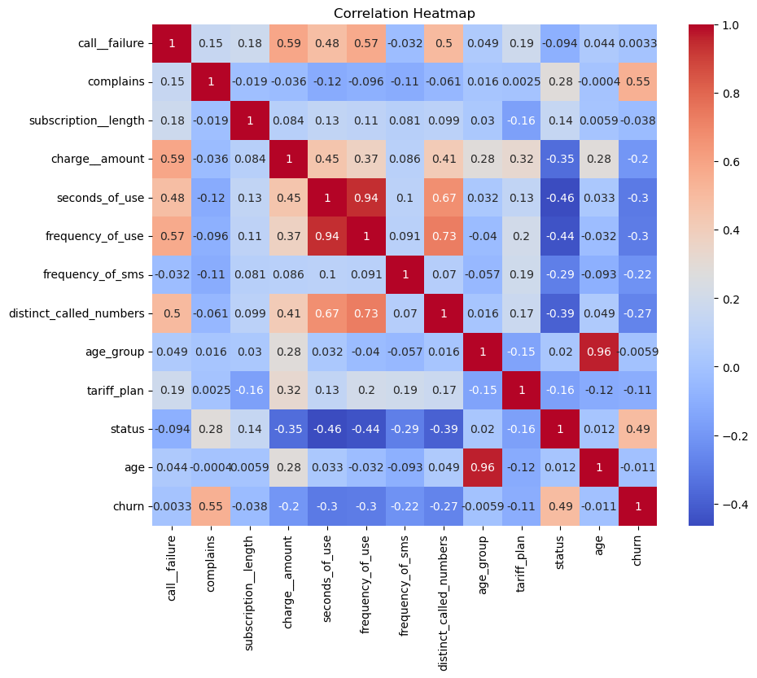

# Customer Churn Analysis
- The goal was to develop a predictive model that could identify customers at risk of leaving, thereby enabling the company to implement targeted retention strategies.
- The task required a comprehensive approach involving data analysis, preprocessing, model training, and evaluation to ensure robust and actionable results.
- The action plan handled duplicate entries, addressed missing values, renamed columns for clarity, detected and treated outliers, and removed irrelevant columns to prepare the data for modelling.
- Successfully evaluated the performance of each model using various metrics and visualized the prediction findings. This step involved using Python and machine learning libraries to ensure accurate and interpretable results.

### Tools:
- Jupyter Notebook and  Google Colab (for code development and experimentation)
- Version Control (Git) for managing code versions and collaboration

### Technologies and Frameworks:
- Pandas (for data analysis, preprocessing, and handling missing values)
- NumPy (for numerical computations)
- Scikit-learn (for model training, evaluation, and metrics)
- Matplotlib and Seaborn (for data visualization)
- Imbalanced-learn (for handling imbalanced datasets, if applicable)
- Statistical Methods (for outlier detection and treatment)

### Languages:
- Python (primary programming language for analysis, preprocessing, modeling, and visualization)

### Repository Includes:
- Source Code
- Report File
### Screenshots

 
.png)
 
.png)
 
