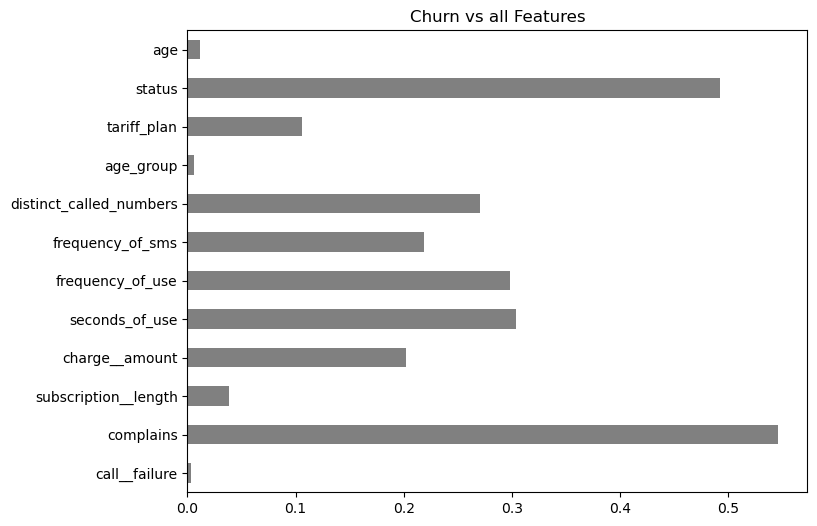
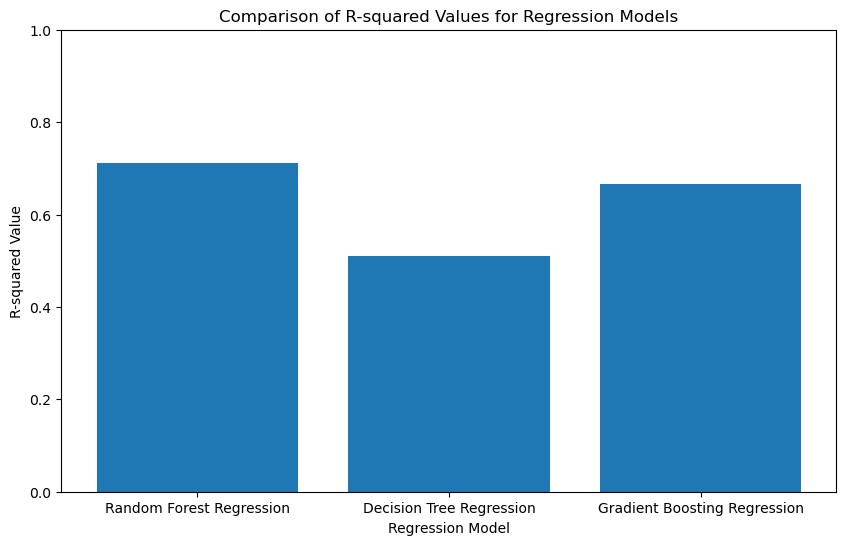

## 📉 Customer Churn Analysis

### ⭐ Situation
The company faced a significant challenge with customer retention, as a noticeable number of customers were leaving, impacting revenue and growth. The leadership team needed a predictive solution to identify customers at risk of churning, allowing them to take proactive steps to retain these customers and improve overall customer satisfaction.

### 🎯 Task
The goal was to develop a predictive model that could accurately identify customers likely to churn. This required a comprehensive approach that involved thorough data analysis, preprocessing, model training, and evaluation to ensure that the results were both robust and actionable.

### 🔧 Action
To achieve this, I undertook the following actions:
1. Handled duplicate entries and addressed missing values to ensure data integrity.
2. Renamed columns for clarity and detected outliers, treating them to maintain data quality.
3. Removed irrelevant columns to streamline the dataset and improve model performance.
4. Trained and evaluated multiple predictive models using Python and machine learning libraries.
5. Assessed model performance using various metrics and visualized the predictions to ensure accurate and interpretable results.

### 🎉 Result
The predictive model successfully identified customers at high risk of churning, enabling the company to implement targeted retention strategies. This proactive approach led to a significant reduction in churn rates, improved customer satisfaction, and ultimately contributed to the company's revenue growth. The actionable insights from the analysis allowed the leadership team to make informed decisions, enhancing overall business performance.

### 🛠️ Tools:
- Jupyter Notebook and  Google Colab (for code development and experimentation)
- Version Control (Git) for managing code versions and collaboration

### Technologies and Frameworks:
- Pandas (for data analysis, preprocessing, and handling missing values)
- NumPy (for numerical computations)
- Scikit-learn (for model training, evaluation, and metrics)
- Matplotlib and Seaborn (for data visualization)
- Imbalanced-learn (for handling imbalanced datasets, if applicable)
- Statistical Methods (for outlier detection and treatment)

### 💻 Languages:
- Python (primary programming language for analysis, preprocessing, modeling, and visualization)

### 🗂️ Repository Includes:
- Source Code
- Report File
### 📸 Screenshots

  

  

  
