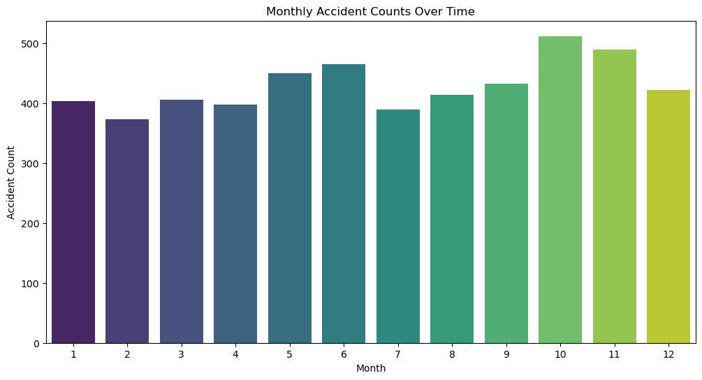
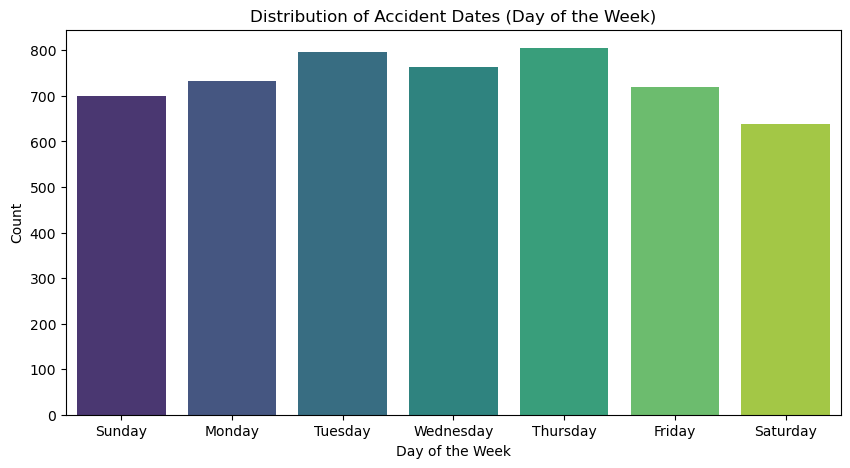

# Road Traffic Accidents Analysis Using Machine Learning Algorithms
- The project aimed to address the increasing number of road traffic accidents by utilizing machine learning to 
analyse and predict accident occurrences. 
- The task required a comprehensive approach involving data analysis, preprocessing, model training, and 
evaluation to ensure robust and actionable results.
- The action plan handled duplicate entries, addressed missing values, renamed columns for clarity, detected 
and treated outliers, and removed irrelevant columns to prepare the data for modelling using Excel and Python 
libraries.
- Conducted an in-depth analysis using six machine learning algorithms, including Random Forest, SVM, and 
Decision Tree, applied python visualization libraries such as seaborn and matplotlib to identify patterns and 
high-risk accident zones, focusing on peak hours.
- Successfully developed and implemented a predictive model with a 90% accuracy rate to forecast road traffic 
accidents, identified high-risk zones and peak hours, providing actionable insights for traffic management and 
accident prevention.

### Tools:
- Excel (for initial data analysis and preprocessing)
- Jupyter Notebook (for code development and experimentation)
- Version Control (Git) for managing code versions
  
### Technologies and Frameworks:
- Pandas (for data analysis and preprocessing)
- NumPy (for numerical computations)
- Scikit-learn (for machine learning model training, evaluation, and metrics)
- Matplotlib and Seaborn (for data visualization)
- Various Machine Learning Algorithms (including Random Forest, SVM, and Decision Tree)
  
### Languages:
- Python (primary programming language for analysis, preprocessing, modeling, and visualization)
  
### Repository Includes:
- Source Code
- Documentation File

### Screenshots

  

  

  

  

  
