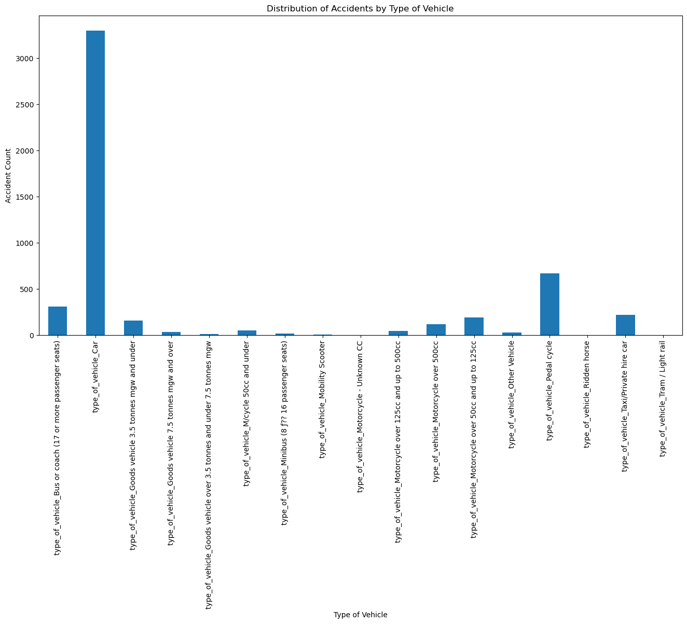

##  🚦 Road Traffic Accidents Analysis Using Machine Learning Algorithms

### ⭐ Situation
The project aimed to address the increasing number of road traffic accidents by utilizing machine learning to analyze and predict accident occurrences. The goal was to develop a predictive model that could provide actionable insights for traffic management and accident prevention.

### 🎯 Task
The task required a comprehensive approach involving data analysis, preprocessing, model training, and evaluation to ensure robust and actionable results. This included handling data issues, training multiple machine learning models, and deriving meaningful patterns to forecast accidents effectively.

### 🔧 Action
The action plan included:
1. Handling duplicate entries, addressing missing values, renaming columns for clarity, detecting and treating outliers, and removing irrelevant columns to prepare the data for modeling.
2. Conducting an in-depth analysis using six machine learning algorithms, including Random Forest, SVM, and Decision Tree.
3. Applying Python visualization libraries such as Seaborn and Matplotlib to identify patterns and high-risk accident zones, focusing on peak hours.

### 🎉 Result
Successfully developed and implemented a predictive model with a 90% accuracy rate to forecast road traffic accidents. Identified high-risk zones and peak hours, providing actionable insights for traffic management and accident prevention.

### 🛠️ Tools
- Excel (for initial data analysis and preprocessing)
- Jupyter Notebook (for code development and experimentation)
- Version Control (Git) for managing code versions

### 💻 Technologies and Frameworks
- Pandas (for data analysis and preprocessing)
- NumPy (for numerical computations)
- Scikit-learn (for machine learning model training, evaluation, and metrics)
- Matplotlib and Seaborn (for data visualization)
- Various Machine Learning Algorithms (including Random Forest, SVM, and Decision Tree)

### 🗂️ Repository Includes
- Source Code
- Documentation File

### 📸  Screenshots

  

  

  

  

  
