## 📊  Sales Analysis Using Excel

### ⭐ Situation
The company was experiencing fluctuations in sales performance across various regions, with inconsistencies in product profitability and uncertainties about the effectiveness of the sales team. The leadership needed a comprehensive understanding of sales trends, regional performance, and product viability to make informed decisions and improve overall business performance.

### 🎯 Task
The goal was to conduct a detailed sales analysis to uncover insights that could guide strategic decision-making. This involved analyzing sales data by country, identifying top-performing products and salespeople, detecting anomalies, and assessing product profitability. The analysis also needed to identify products that should potentially be discontinued due to poor performance.

### 🔧 Action
To address these needs, I undertook the following actions:
1. Generated quick statistics to provide an overview of the sales data.
2. Conducted Exploratory Data Analysis (EDA) using the CF method to identify trends and patterns.
3. Analyzed sales by country using both formulas and pivot tables to ensure accuracy and comparability.
4. Identified the top 5 products by revenue per unit and detected any data anomalies.
5. Assessed the best salesperson in each country, analyzed product profits using the products table, and developed a dynamic country-level sales report.
6. Evaluated product performance to recommend which products should be discontinued.

### 🎉 Result
The analysis provided critical insights that allowed the company to streamline its product offerings, resulting in the discontinuation of underperforming products. Regional sales strategies were optimized based on the identification of top-performing salespeople and countries. Additionally, the detection of anomalies and detailed profit analysis led to improved data accuracy and more informed decision-making, ultimately contributing to a significant increase in overall sales and profitability.

### 🛠️ Tools
- MS Excel 365

### 💻 Technologies
- Data Analysis Expressions (DAX)
- Pivot tables
- Formulas
- XLOOK UP

### 🧰 Frameworks
- Exploratory Data Analysis (EDA)
- Data Cleansing and Transformation
- Business Intelligence Reporting

### 🗂️ Repository Includes
- Workbook File

### 📸 Screenshots
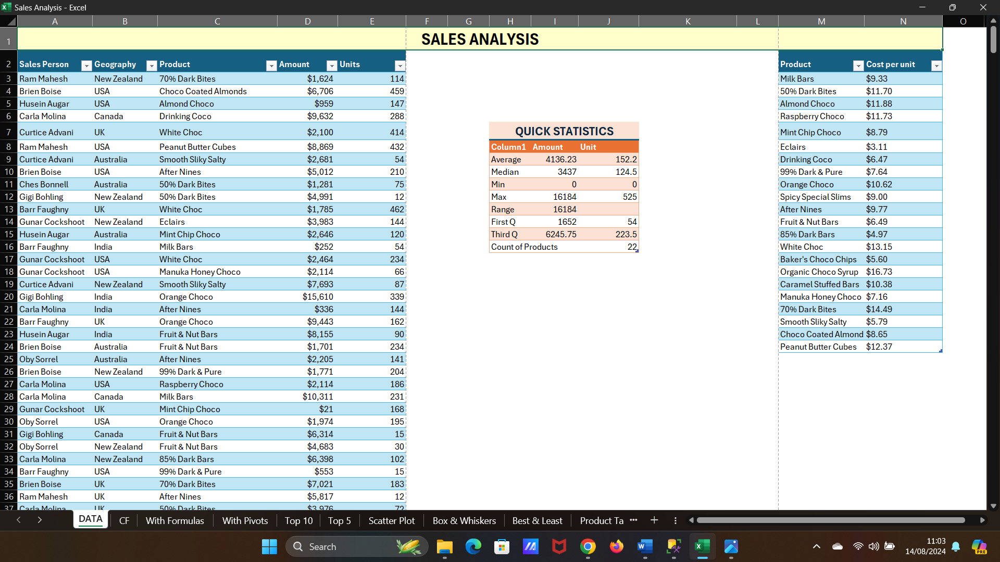  
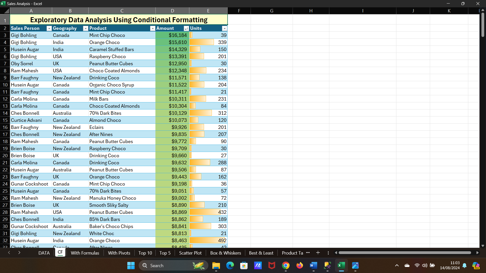  
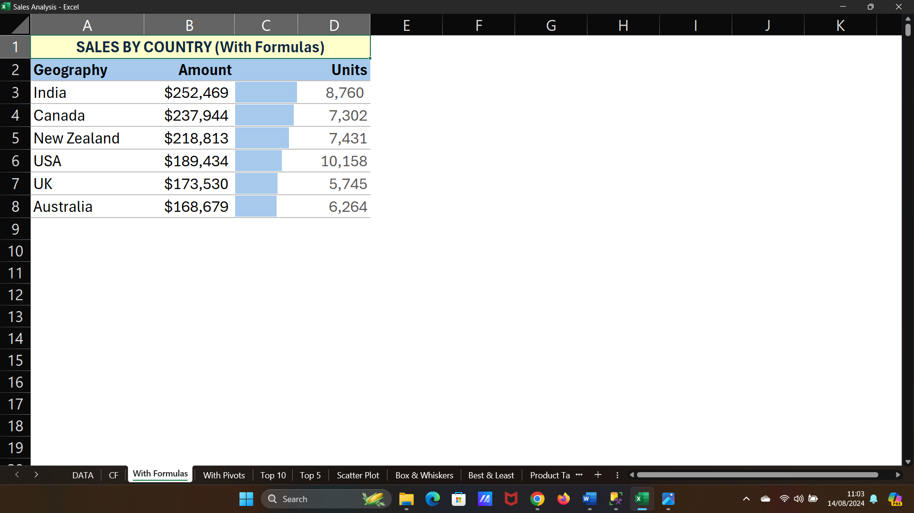  
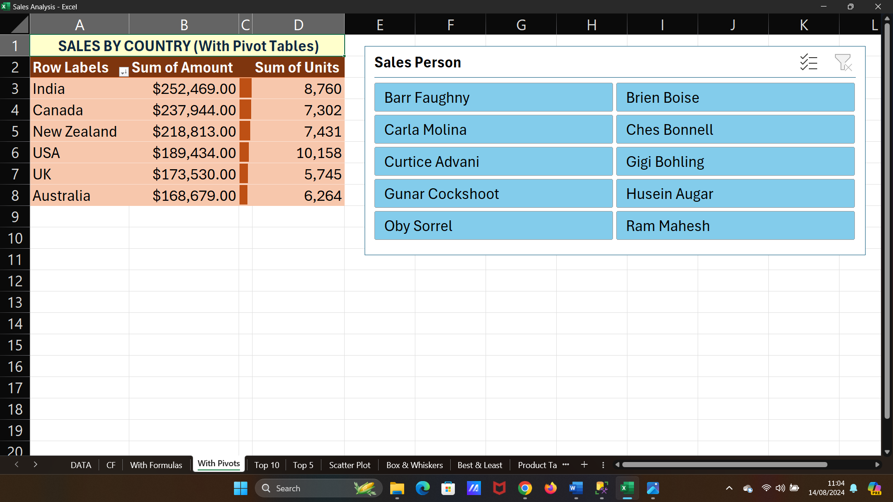  
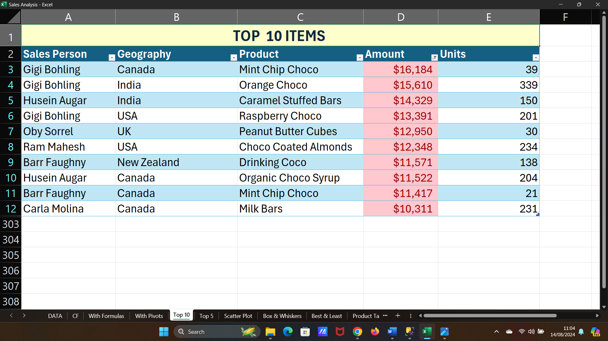  
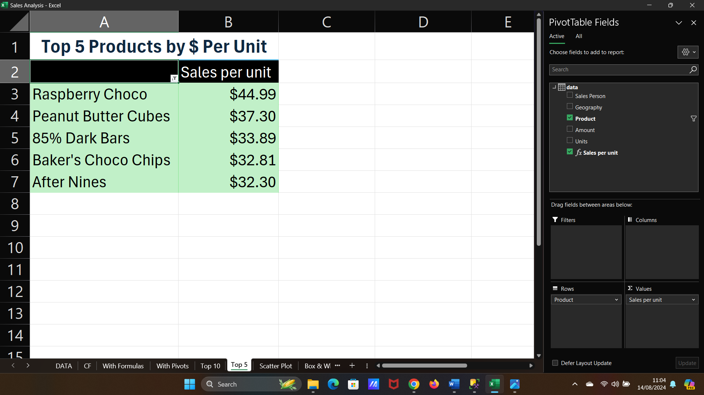  
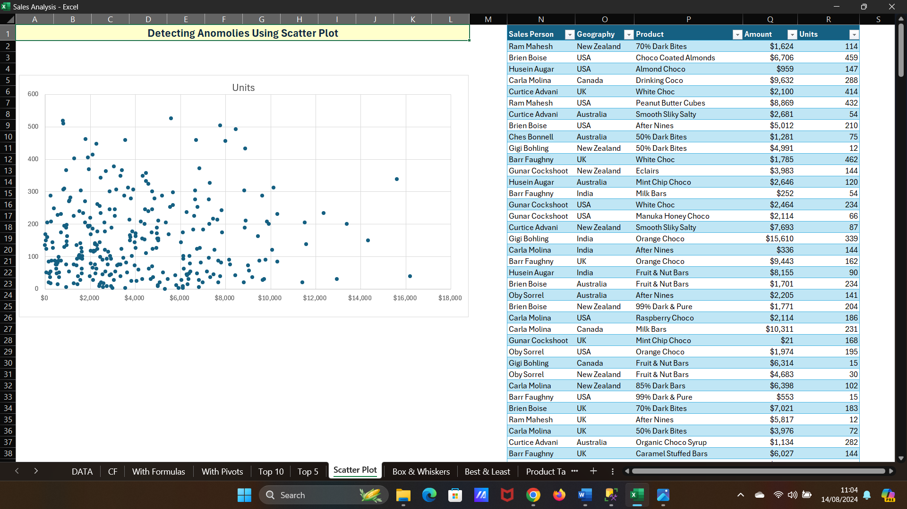4  
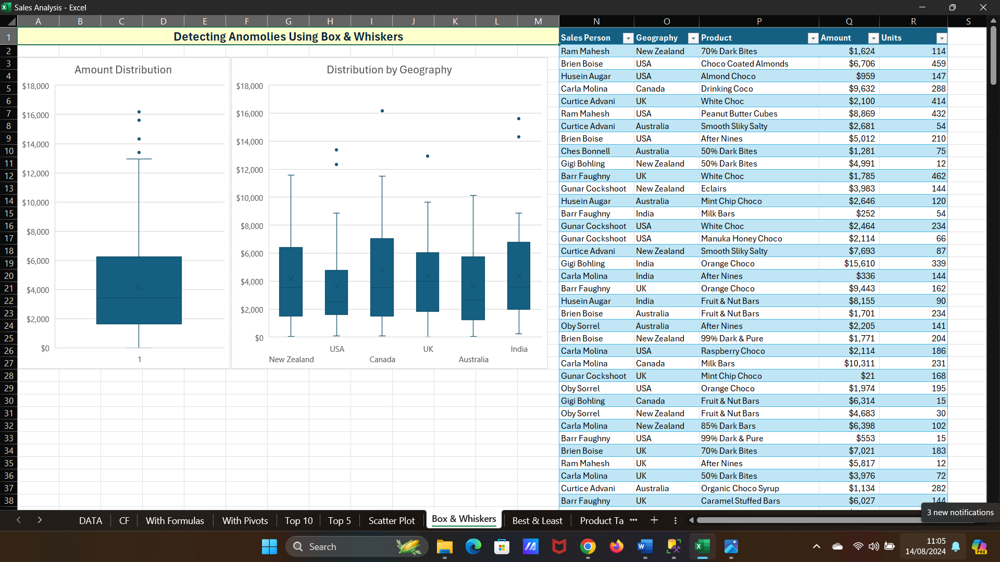  
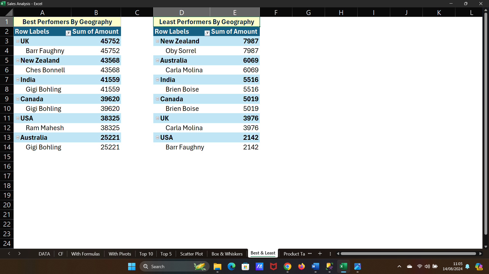  
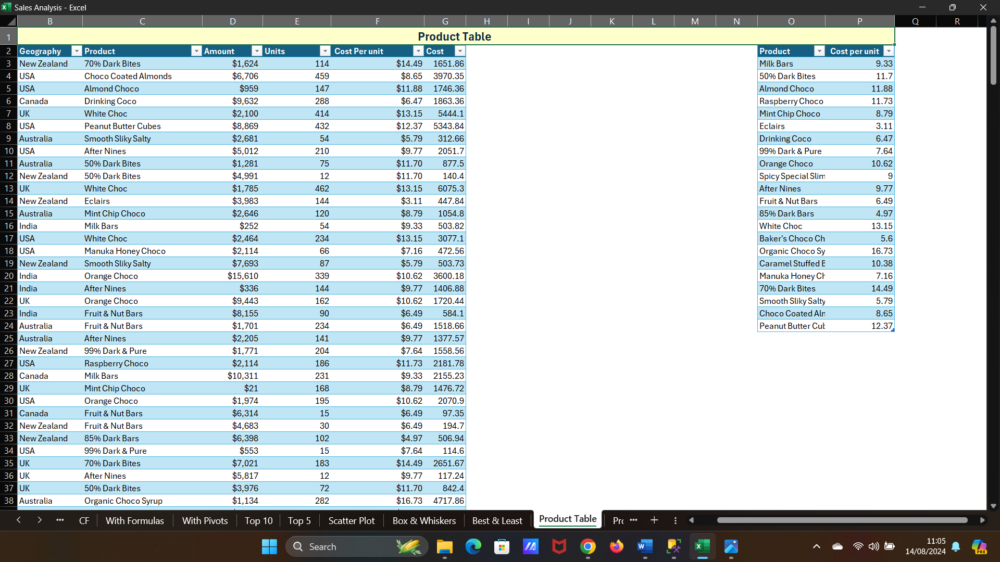  
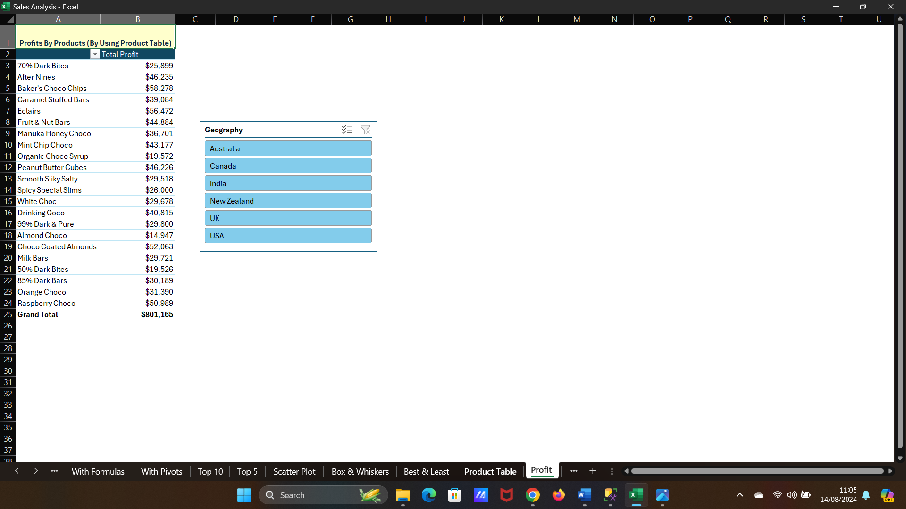  
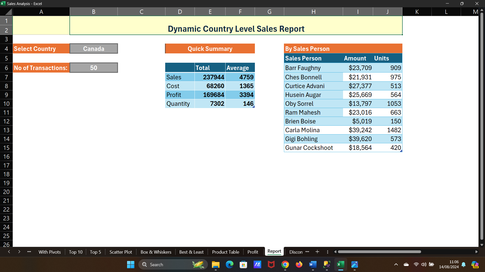  
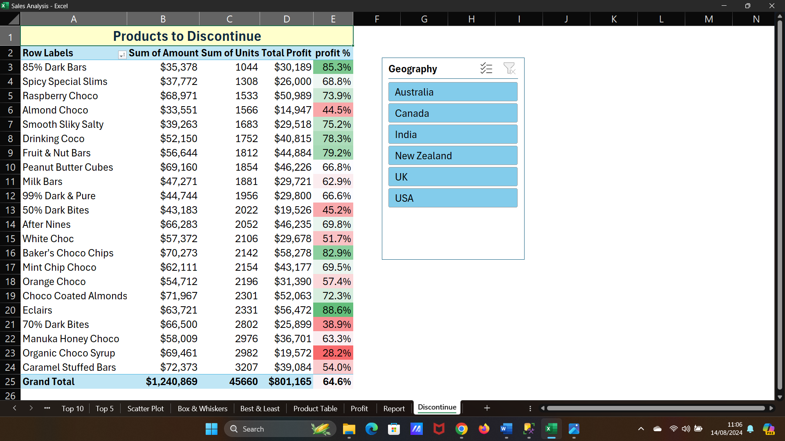  

