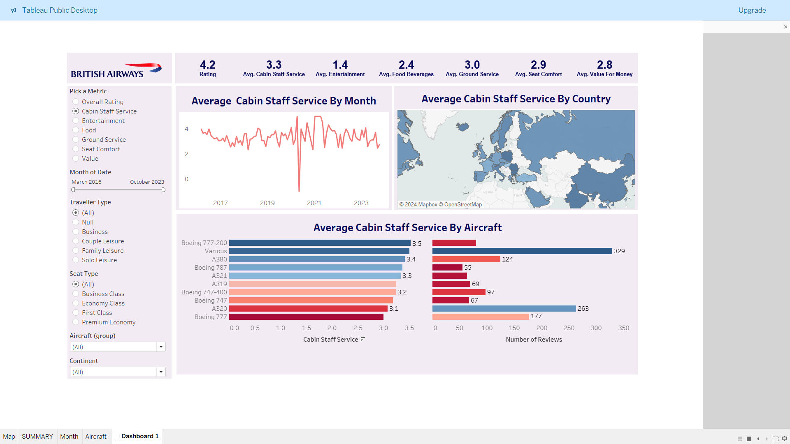

# ✈️ British Airways Review Analysis Dashboard

## ⭐ Situation:
British Airways, a major global airline, receives a vast amount of customer feedback across various service aspects, such as cabin staff service, entertainment, food, and seat comfort. However, analyzing this data to understand customer satisfaction trends, identify areas for improvement, and make informed decisions was challenging due to the unstructured and dispersed nature of the data.

## 🎯 Task:
The objective was to create an interactive and comprehensive dashboard that would allow stakeholders to easily analyze customer reviews and ratings. The dashboard needed to support detailed analysis across various dimensions, such as time, traveler type, seating class, aircraft type, and geographical distribution of ratings. The goal was to provide actionable insights that could help British Airways improve its services and enhance customer satisfaction.

## 🔧 Action:
- Collected and cleaned customer review data from kaggle data set for British Airways reviews, ensuring consistency and accuracy.
- Developed a Tableau dashboard featuring multiple interactive elements:
  - **📈 Line Chart** to visualize the trend of overall ratings over time.
  - **🗺️ Filled Map** to display the geographical distribution of average ratings by country.
  - **📊 Bar Chart** to compare average ratings across different aircraft types.
- Integrated multiple filters, including Metric selection, Date range, Traveler Type, Seat Type, Aircraft Group, and Continent, to allow users to drill down into specific aspects of the data.
- Ensured the dashboard was user-friendly and provided a seamless experience for exploring and interpreting the data.

## 🏆 Result:
The interactive dashboard successfully transformed complex and extensive customer review data into a visually intuitive and actionable tool. Stakeholders could now easily:
- Track customer satisfaction trends over time.
- Identify regions with higher or lower satisfaction.
- Compare performance across different aircraft types and service classes.
- Tailor marketing and service improvement strategies based on detailed traveler demographics.

This project not only provided valuable insights but also enabled British Airways to make data-driven decisions that could lead to enhanced customer experiences and service quality.
## 🗂️ Repository Includes
 - Tableau Workbookfile
 - Data Set
## 📸 Screenshots
  
  
  
  
  
  
  

