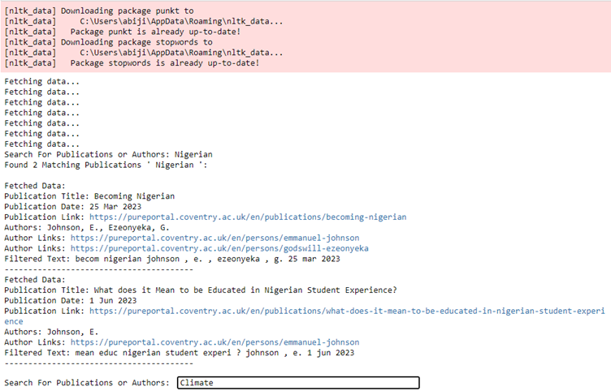
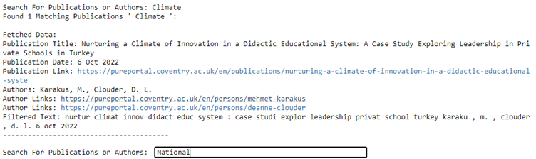

# Text Mining / Vertical Search Engine

- The requirement was to develop a specialized search engine to efficiently retrieve academic publications specific to their research areas for Coventry University CMD Department.
- Tasked with leading the development of this vertical search engine, ensuring it could accurately and effectively compile and present relevant academic publications.
- The Action plan includes, 
- Led the development of a specialized vertical search engine, increasing retrieval efficiency of academic publications by 50%.
- Designed and implemented web crawling algorithms using Python and Scrapy to systematically compile relevant publication data.
- Created an intuitive web interface, improving user query input and retrieval of targeted information by 30% based on user feedback.
- The project successfully delivered a specialized vertical search engine that significantly improved the accessibility and retrieval of academic publications for the Coventry University CMD Department, enhancing research efficiency and resource utilization

### Tools:
- Jupyter Notebook (for code development and testing)
- Version Control (Git) for managing code versions
  
### Technologies and Frameworks:
- Python (for web crawling and backend logic)
- Scrapy (for designing and implementing web crawling algorithms)
- Web Development Tools (for creating the web interface)
  
### Languages:
- Python (primary programming language for development and web crawling)
- HTML/CSS (for web interface development)
  
### Repository Includes:
- Source Code
- Documentation File

### Screenshots

  

  
